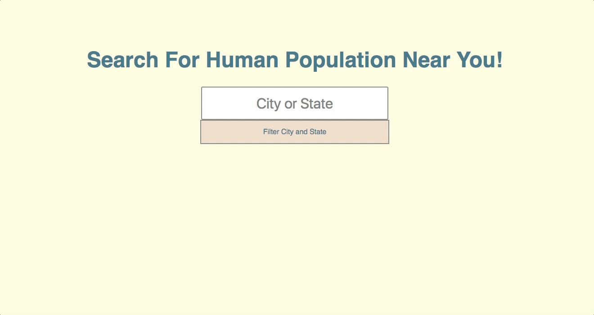

# Search Bar: Where's My City and How Many Humans Are There?

With this project, it utilizes vanilla JavaScript, a simple JSON file with data of 1000 cities, and regex to highlight search input and immediately display matches below.

