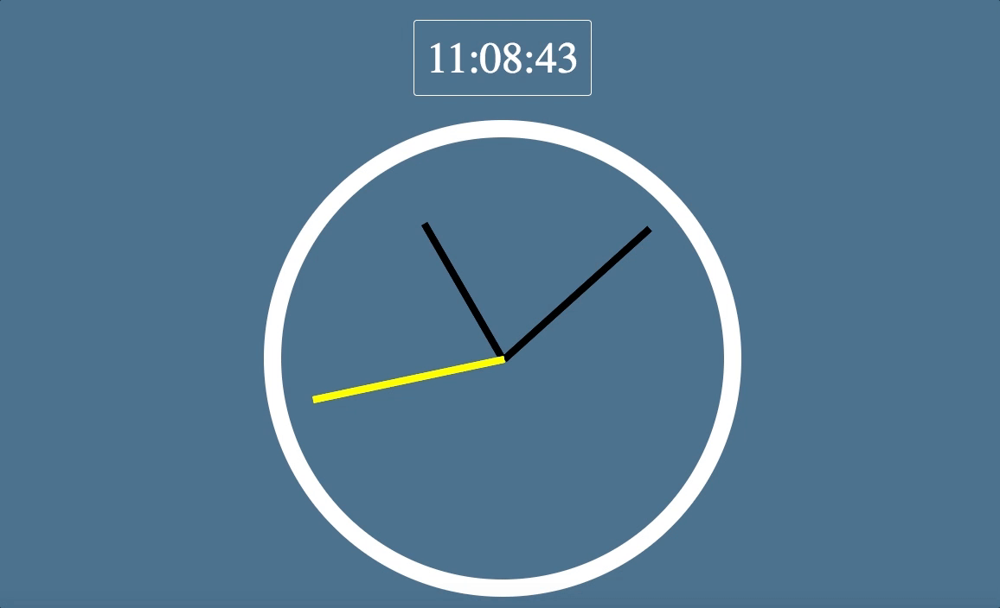

# My AWESOME CLOCK

Using vanilla javascript and Date objects, I built a clock that rotates using transform, transition, and transition-timing-function attributes in CSS.

## Instructions
- Open index.html to see MY AWESOME CLOCK

